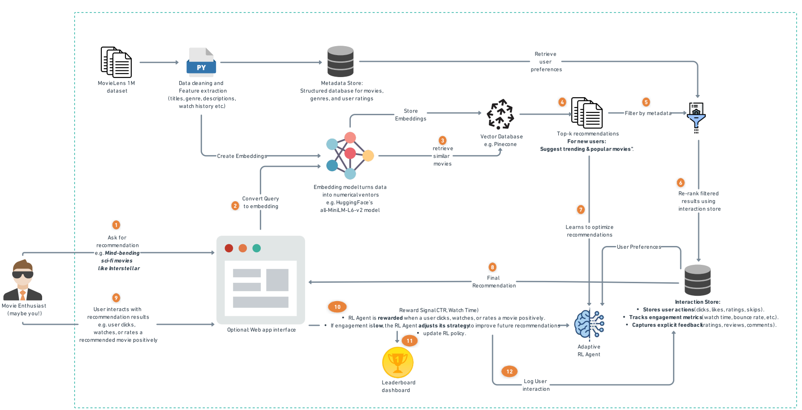

# **CineSense: Reinforcement Learning-Driven RAG Movie Recommendation System 🎬🤖**

## 📌 Overview
CineSense is a Generative AI-driven movie recommendation system designed to deliver semantic, personalized, and explainable suggestions. The MVP focuses on Retrieval-Augmented Generation (RAG) with Reinforcement Learning (RL) for feedback-driven optimization.

Long-term, CineSense aims to replicate key architectural principles from Netflix's latest research, including:

A Foundation Model for Personalized Recommendation (2025)

The UniCoRn unified ranking model (2024)

These serve as inspiration for extending CineSense into a multi-task, scalable, and unified recommendation framework.

🔭 Project Roadmap

- 🔄 MVP – Current Implementation
    - Retrieval using Sentence-BERT + FAISS

    - Feedback loop with Reinforcement Learning (PPO/DQN)

    - Basic interaction simulation and explainable UI

- 🔄 Phase 2 – Netflix Foundation Model Replication (Inspired by: Netflix’s Foundation Model for Personalized Recommendation (2025))
    - Unified Preference Learning across tasks (e.g., viewing history, ratings, clicks)

    - Modeling long-term interaction history for deeper personalization

    - Embedding model upgrades (e.g., CLIP, T5 variants, Titan via AWS Bedrock)

    - Modular architecture for multi-domain recommendation

- 🔄 Phase 3 – UniCoRn-Based Contextual Ranker (Inspired by: Joint Modeling of Search and Recommendations via a Unified Contextual Ranker (UniCoRn, 2024))
    - Joint modeling of query-video and video-video relationships

    - Context-aware ranking using contextual embeddings and deep learning

    - Incorporation of query metadata, session length, CTR, and dwell time

    - Unified multi-task pipeline: search + recommendations


---

## 🚀 MVP Features 
✅ **RAG-Based Retrieval** – Uses **Sentence-BERT embeddings** and **vector similarity search** to retrieve relevant movies.  
✅ **Reinforcement Learning Optimization** – Trains an **RL agent (DQN/PPO)** to improve recommendations based on **user engagement**.  
✅ **Multi-Modal Data** – Integrates **metadata, genres, reviews, and external ratings (IMDb, Rotten Tomatoes)**.  
✅ **Explainability** – Provides **human-like justifications** for recommendations.  
✅ **API & UI** – Features a **REST API (FastAPI/Flask)** and an interactive **UI (Streamlit/Gradio)**.  




## 📁 Project Structure
```
CineSense
│── data/                      # Datasets (raw & processed)
│── models/                    # Trained models & checkpoints
│── src/                       # Core code (retrieval, RL, recommendation logic)
│── notebooks/                 # Jupyter notebooks (EDA, training)
│── ui/                        # UI (Streamlit/Gradio)
│── tests/                     # Unit tests
│── requirements.txt           # Dependencies
│── config.yaml                # Configurations
│── README.md                  # Project documentation

```

## 🛠️ Setup Instructions

### **1️⃣ Clone the Repository**
```bash
git clone https://github.com/ishi3012/cine_sense_rl_rag.git
cd CineSense
```

2️⃣ Install Dependencies
``` bash
pip install -r requirements.txt
```

🔄 Preprocess MovieLens 1M Dataset
Before training models, preprocess the MovieLens dataset.

Run Preprocessing (First Time)

``` bash
python src/data_preprocessing.py
```
👉 If the processed data (train.csv and test.csv) already exists, this step will be skipped.

Force Reprocess Raw Data, if you need to reprocess the data, use: 
``` bash
python src/data_preprocessing.py --force
```
👉 This will overwrite train.csv and test.csv.

3️⃣ Run the API

```bash
uvicorn src.api:app --reload
```

4️⃣ Launch the UI
```bash
streamlit run ui/app.py
```
🔍 How It Works
- **Retrieval Module** – Retrieves movies using Sentence-BERT embeddings and vector search.
- **RL Agent – Optimizes** - recommendations based on click-through rate (CTR) & watch time.
- **User Interaction Simulation** – Generates synthetic feedback for RL training.
- **Recommendations API** – Provides real-time movie suggestions.

🌟 Future Enhancements
- Real-time trend updates (e.g., trending movies, new releases).
- Multi-modal recommendations (text + trailers + user behavior).
- Advanced RL techniques (Contextual Bandits, Model-based RL).
- A/B Testing for model evaluation.

🤝 Contributions
Contributions are welcome! Open an issue or submit a PR 🚀.

## 📜 License

This project is licensed under the MIT License. See the [LICENSE](./LICENSE) file for more details.